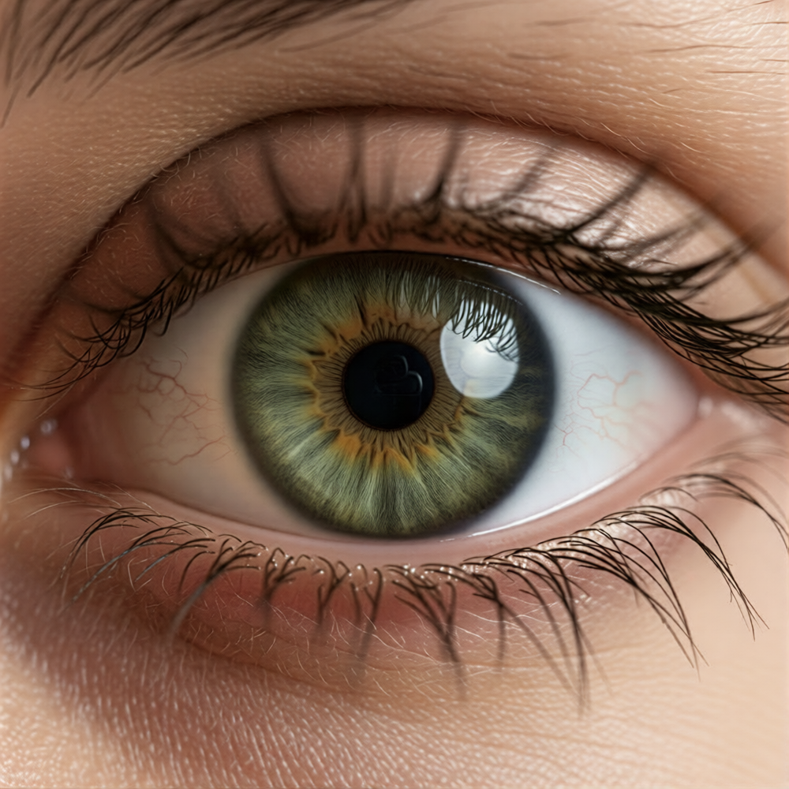
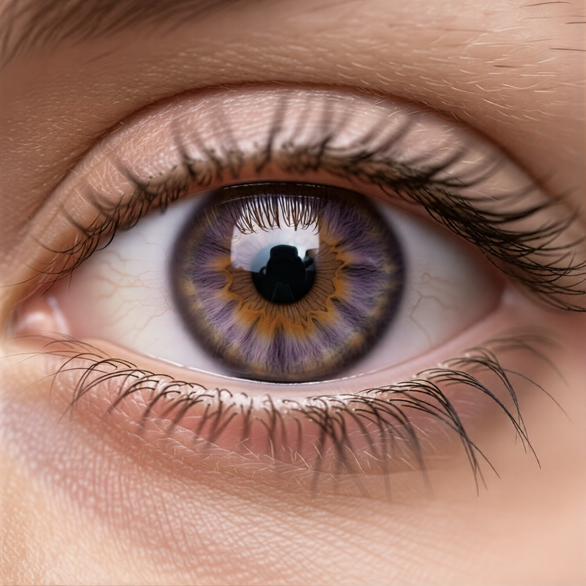

  Exemplo de combinação:

- Ângulo da câmera /camera-angle/Cam-Cinematic.json
- Cenário /scenario/snow-mountain.json
- Iluminação /cinematic-selfie.json
- Objetos - [seu avatar]

# Boca

  
  

# Olhos

  
  

# Inserindo objetos

  

  
  

